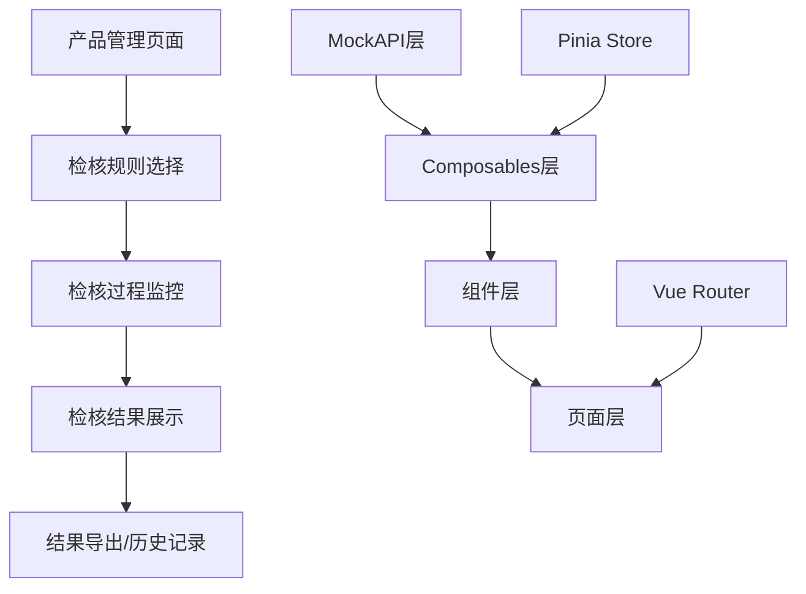

# 产品检核结果展示模块设计文档

## 概述

产品检核结果展示模块是一个完整的前端展示系统，负责从产品管理页面的检核入口开始，到检核结果展示和导出的全流程用户界面实现。本模块采用Vue 3 + TypeScript + Composition API架构，使用Mock数据模拟后台业务逻辑，为用户提供流畅的检核体验。

## 指导文档对齐

### 技术标准 (tech.md)
本设计遵循项目既定的技术栈标准：
- Vue 3 + TypeScript + Composition API模式
- Ant Design Vue 4.x UI组件库
- Pinia状态管理
- Vue Router模块化路由
- Axios HTTP客户端

### 项目结构 (structure.md)
遵循现有项目的组织约定：
- 模块化组件设计（components/audit/）
- 页面级视图（views/audit/）
- 专用Composables（composables/audit/）
- Mock数据管理（api/mock/audit/）

## 代码复用分析

### 现有组件复用
- **BaseButton**: 复用通用按钮组件，用于检核操作按钮
- **ProductTable**: 扩展产品表格组件，添加检核入口操作
- **PermissionWrapper**: 复用权限控制组件，控制检核功能访问权限
- **TableToolbar**: 复用表格工具栏组件，用于检核规则选择页面

### 现有服务复用
- **API模块模式**: 复用现有api/modules/的模块化API设计模式
- **Loading状态管理**: 复用authApi中的withLoading加载状态管理模式
- **路由模块化**: 复用router/modules/的路由模块化设计

### 集成点
- **产品管理系统**: 与ProductManagementView集成，添加检核入口
- **用户认证系统**: 集成现有的权限验证和用户状态管理
- **主页导航**: 与现有的侧边栏导航和面包屑导航集成

## 架构

本模块采用分层架构设计，遵循单一职责原则和组件隔离原则：

### 模块化设计原则
- **单文件职责**: 每个组件文件专注处理一个特定的检核功能
- **组件隔离**: 创建小而专注的组件，避免大型单体组件
- **服务层分离**: 分离数据访问、Mock逻辑和表现层
- **工具模块化**: 将检核相关工具函数分解为专用模块



## 组件和接口

### AuditRuleSelection 组件
- **目的**: 检核规则选择和配置界面
- **接口**:
  - Props: `productIds: string[]`
  - Emits: `rule-selected`, `cancel`
- **依赖**: AuditRulesAPI, useAuditRules composable
- **复用**: RulesFilterBar组件模式, TableToolbar样式

### AuditProcessMonitor 组件
- **目的**: 实时显示检核进度和状态
- **接口**:
  - Props: `taskId: string`
  - Emits: `process-complete`, `process-error`
- **依赖**: AuditTaskAPI, useRealTimeProgress composable
- **复用**: Loading状态管理模式

### AuditResultDisplay 组件
- **目的**: 分类展示检核结果和统计信息
- **接口**:
  - Props: `taskId: string`, `resultData: AuditResult[]`
  - Emits: `export-results`, `back-to-list`
- **依赖**: AuditResultAPI, useResultDisplay composable
- **复用**: ProductTable的表格展示模式

### AuditResultExport 组件
- **目的**: 检核结果导出功能
- **接口**:
  - Props: `resultData: AuditResult[]`, `exportFormat: string`
  - Emits: `export-complete`
- **依赖**: ExportAPI, useFileExport composable
- **复用**: 文件下载处理模式

### AuditHistoryManager 组件
- **目的**: 历史检核记录管理
- **接口**:
  - Props: `productId?: string`
  - Emits: `view-history`, `delete-record`
- **依赖**: AuditHistoryAPI, useAuditHistory composable
- **复用**: ProductTable分页和筛选模式

## 数据模型

### AuditTask 模型
```typescript
interface AuditTask {
  id: string
  productIds: string[]
  ruleIds: string[]
  status: 'pending' | 'running' | 'completed' | 'failed'
  createdBy: string
  createdTime: Date
  completedTime?: Date
  totalProducts: number
  completedProducts: number
  totalErrors: number
}
```

### AuditRule 模型
```typescript
interface AuditRule {
  id: string
  code: string // CC001-CC017
  name: string
  source: string
  applicableInsuranceType: string[]
  applicableChapter: string
  managementDepartment: string
  ruleType: 'single' | 'double' | 'format' | 'advanced'
  effectiveStatus: 'active' | 'inactive'
  auditStatus: 'approved' | 'pending' | 'rejected'
  effectiveStartTime: Date
  effectiveEndTime?: Date
}
```

### AuditResult 模型
```typescript
interface AuditResult {
  id: string
  taskId: string
  productId: string
  documentType: 'terms' | 'feasibility' | 'comparison'
  ruleId: string
  ruleCode: string
  suggestion: string
  applicableChapter: string
  ruleSource: string
  managementDepartment: string
  ruleType: string
  originalContent: string
  pageNumber: string
  highlightPosition?: HighlightPosition
  severity: 'high' | 'medium' | 'low'
  createdTime: Date
}
```

### AuditStatistics 模型
```typescript
interface AuditStatistics {
  id: string
  taskId: string
  documentType: 'terms' | 'feasibility' | 'comparison'
  ruleTypeStats: {
    single: number
    double: number
    format: number
    advanced: number
  }
  totalCount: number
}
```

## 错误处理

### 错误场景
1. **Mock数据加载失败**
   - **处理**: 显示友好错误提示，提供重试按钮
   - **用户体验**: "数据加载失败，请重试"

2. **检核任务启动失败**
   - **处理**: 重置表单状态，显示具体错误原因
   - **用户体验**: "检核任务启动失败：[具体原因]"

3. **检核过程中断**
   - **处理**: 保存当前进度，提供恢复或重新开始选项
   - **用户体验**: "检核过程已中断，您可以选择恢复或重新开始"

4. **结果导出失败**
   - **处理**: 提供多种导出格式备选，记录失败日志
   - **用户体验**: "导出失败，请尝试其他格式或稍后重试"

5. **页面路由错误**
   - **处理**: 自动重定向到产品管理页面，显示导航提示
   - **用户体验**: "页面访问异常，已为您返回产品管理页面"

## 测试策略

### Unit Testing
- **Composables测试**: 测试useAuditRules, useAuditResults等业务逻辑
- **组件测试**: 测试各检核组件的渲染和交互
- **Mock数据测试**: 验证Mock数据的结构和完整性
- **工具函数测试**: 测试检核相关的工具函数

### Integration Testing
- **检核流程测试**: 端到端测试完整的检核流程
- **Mock API集成测试**: 测试前端与Mock API的集成
- **路由集成测试**: 测试页面间的导航和状态传递
- **状态管理集成测试**: 测试Pinia store的状态同步

### End-to-End Testing
- **用户检核流程**: 模拟用户完整的检核操作流程
- **多产品批量检核**: 测试批量检核的用户体验
- **结果查看和导出**: 测试结果展示和导出功能
- **历史记录管理**: 测试历史记录的查看和管理

### Mock数据测试
- **数据一致性**: 确保Mock数据与原型页面完全一致
- **状态模拟**: 测试各种检核状态的Mock数据展示
- **错误场景模拟**: 测试Mock数据在异常情况下的表现
- **性能测试**: 测试大量Mock数据的渲染性能

## 技术实现细节

### Mock数据管理
- 使用Mock.js生成符合原型的动态数据
- 实现本地存储持久化，模拟真实的数据状态
- 提供开发模式的数据重置和调试功能

### 状态管理策略
- 使用Pinia进行检核流程状态管理
- 实现检核进度的响应式更新
- 缓存检核结果数据，优化用户体验

### 路由和导航
- 实现嵌套路由，支持检核流程的多步骤导航
- 提供面包屑导航，清晰显示当前步骤
- 支持检核流程的前进/后退操作

### 性能优化
- 使用Vue 3的Suspense处理异步加载
- 实现虚拟滚动，优化大量检核结果的展示
- 使用keep-alive缓存检核页面状态