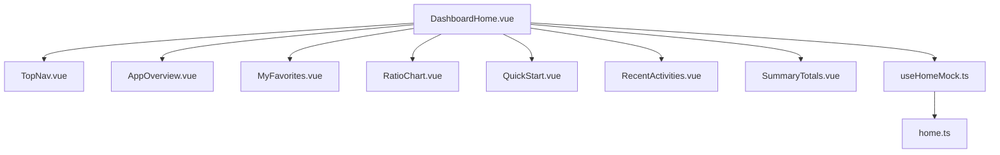

# Design Document

## Overview
“dashboard-home”在MVP阶段提供登录后工作台的纯前端展示，实现对原型页面`页面原型设计/主页面.html`的像素级还原，所有数据来源于前端本地 mock，不依赖后端。页面作为`/`路由的落地页，并提供到“产品管理/规则管理/设置”等功能的占位导航。

## Steering Document Alignment

### Technical Standards (tech.md)
- 前端技术栈：Vue 3 + Vite + TypeScript；状态管理 Pinia；路由 Vue Router；图表优先 ECharts（或静态图）。
- 安全与合规：MVP 无敏感后端调用，仅本地 mock；后续接入 JWT/权限时遵循安全标准。
- 性能：首屏渲染≤3秒（本地 mock）；代码模块化，提升可维护性。

### Project Structure (structure.md)
- 目录与命名遵循现有前端结构：`frontend/src/views/`存放页面，`frontend/src/components/`存放组件，`frontend/src/api/mock/`存放 mock 数据。
- 采用组件化拆分：TopNav/AppOverview/MyFavorites/RatioChart/QuickStart/RecentActivities/SummaryTotals。

## Code Reuse Analysis
- 复用：`frontend/src/assets/styles/`中的全局样式与变量（如有）；`src/router`现有守卫机制；`src/utils`通用工具。
- 不依赖：后端 API；真实鉴权；真实图表服务。图标采用 Font Awesome 4.7（CDN或本地）复刻原型字符图标。

### Existing Components to Leverage
- Ant Design Vue（如已有）用于基础排版；但为保证像素一致，关键区域使用自定义样式。
- 现有`router`与布局容器（`App.vue`）保持不变。

### Integration Points
- 路由跳转：
  - 登录成功 → `/`（DashboardHome）。
  - 导入产品 → `/product/import`（占位）。
  - 创建规则 → `/rules/create`（占位）。
  - 批量导入 → `/product/import/batch`（占位）。
  - 下载模板 → 触发本地静态文件下载 `/public/template.xlsx` 或提示。
  - 产品详情 → `/product/detail/:id`（占位）。
- 图表：ECharts 本地数据渲染；若未引入 ECharts，使用静态图片保持观感一致。

## Architecture
- 单页组件`DashboardHome.vue`负责组装布局与区域标题，其余逻辑下沉至子组件。
- 数据层：`src/api/mock/home.ts`导出只读常量对象，所有组件以 props/composable 读取，便于未来替换为 API。
- 样式：组件局部`<style scoped lang="scss">`；必要处使用精确 px 值，颜色与字号严格对齐原型：
  - 导航背景 `#001529`；
  - 链接蓝 `#0079FE`；次级文案 `#999999`；
  - 上升箭头红 `#F95E5A`；下降箭头绿 `#4BD863`；
  - 关键数字 28px/20px；标签 14px。
- 视口：固定版心宽 1440，内容区域左右两栏（左 1100px，右 552px）对应原型。

### Modular Design Principles
- 文件单一职责：每个功能区独立组件；mock 数据独立文件；图表渲染独立。
- 组件隔离：各组件仅依赖传入数据与自身样式，不侵入全局。
- 服务层分离：MVP 无后端访问；数据访问以`useHomeMock()`抽象，后续替换为 API 层不影响视图。



## Components and Interfaces

### TopNav.vue
- Purpose: 顶部导航栏，显示品牌、菜单与用户名。
- Interfaces: `props: { menus, active, brand, username }`；`emit: navigate(menuKey)`。
- Dependencies: Font Awesome（图标）；全局样式变量（可选）。

### AppOverview.vue
- Purpose: 左上“应用概要”统计卡片区（8项）。
- Interfaces: `props: { overview }`（含所有数值与同比趋势）。
- Dependencies: 无强依赖；内部处理箭头颜色/方向。

### MyFavorites.vue
- Purpose: “我的关注”任务列表，含搜索/筛选/滚动列表。
- Interfaces: `props: { items, filters }`；可选`emit: select(item) / search(keyword)`。
- Dependencies: Font Awesome；本地轻量过滤（可选）。

### RatioChart.vue
- Purpose: “数量统计占比”饼图与右侧类型列表，含三标签切换（默认“产品类型”）。
- Interfaces: `props: { tabs, active, productTypes }`；`emit: changeTab(tab)`。
- Dependencies: ECharts（可选）；或静态图片占位。

### QuickStart.vue
- Purpose: “快速开始/便捷导航”，六按钮与徽章。
- Interfaces: `props: { items }`；`emit: click(action)`。
- Dependencies: 路由；徽章定位样式。

### RecentActivities.vue
- Purpose: “近期动态”，时间倒序列表，产品名蓝色链接。
- Interfaces: `props: { activities }`；`emit: open(link)`。
- Dependencies: 路由。

### SummaryTotals.vue
- Purpose: 底部“汇总数据”，四指标与时间标签（默认“总计”高亮）。
- Interfaces: `props: { ranges, activeRange, metrics }`；`emit: changeRange(range)`。
- Dependencies: 无。

## Data Models

### home.ts（只读 mock）
```ts
export interface HomeMock {
  topNav: { brand: string; menus: string[]; active: string; username: string };
  appOverview: {
    totalProducts: number;
    last7DaysProducts: { value: number; yoy: number; trend: 'up' | 'down' };
    last30DaysProducts: { value: number; yoy: number; trend: 'up' | 'down' };
    errorRate: string;
    totalRules: number;
    last7DaysRules: { value: number; yoy: number; trend: 'up' | 'down' };
    last30DaysRules: { value: number; yoy: number; trend: 'up' | 'down' };
    avgAuditTime: string;
  };
  myFavorites: {
    filters: { keywordPlaceholder: string; timeLabel: string; typeLabel: string };
    items: Array<{ name: string; type: '审核' | '配置'; submitter: string; submittedAt: string; icon: string; id?: string }>;
  };
  ratioChart: {
    tabs: string[];
    active: string;
    productTypes: Array<{ label: string; percent: number; count: number; color: string }>;
  };
  quickStart: { items: Array<{ label: string; route: string; badge?: number }> };
  recentActivities: Array<{ type: string; text: string; time: string; link?: string }>;
  summaryTotals: { activeRange: string; ranges: string[]; metrics: Array<{ label: string; value: number }> };
}
```

- 示例数据：严格按原型与`Docs/主页面需求.md`给定值（详见需求文档与mock实现）。

## Error Handling
- 图表库加载失败：降级为静态图片；提示隐藏，仅保持布局。
- 字体/图标加载失败：使用后备字体栈与字符占位，保证布局不塌陷。
- 路由目标不存在：统一跳转占位页并提示“功能建设中”。

## Testing Strategy

### Unit Testing
- 组件渲染：`TopNav`/`AppOverview`/`MyFavorites`/`RatioChart`/`QuickStart`/`RecentActivities`/`SummaryTotals` props 数据驱动渲染正确。
- 样式类与选中态：导航高亮、时间标签 selected、高亮颜色等与期望匹配。

### Integration Testing
- 页面组装：`DashboardHome.vue`正确组合各组件并传入 mock；路由跳转动作触发。
- 本地过滤（如启用）：输入关键词后列表过滤变化。

### End-to-End Testing
- 登录后跳转到`/`；首页元素可见（区域标题/按钮/列表/图表/汇总区）。
- 快速开始按钮可点击并进入占位路由；产品链接可点击进入详情占位。
- 近期动态“查看更多”可点击（MVP 可保持静态）。
