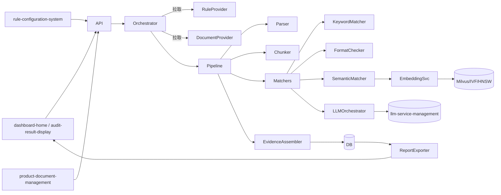
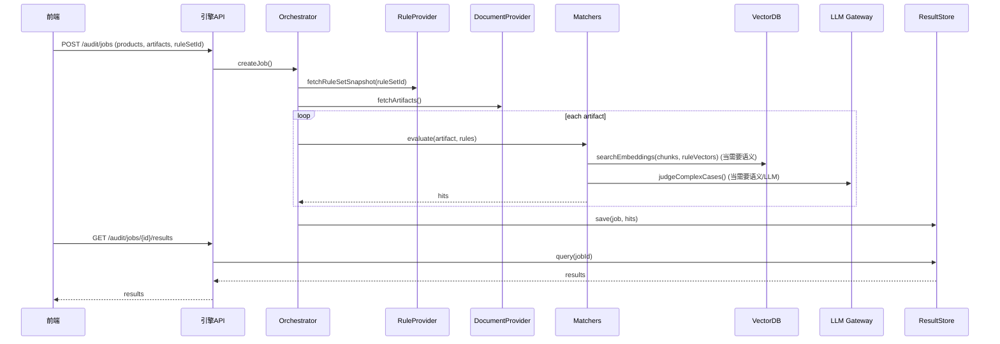

## 智能检核引擎（intelligent-audit-engine）- 设计说明（Design）

### 概述
- 本设计基于已批准的 `requirements.md`，实现一个面向保险产品全要件的多层检核引擎：关键词/正则 → 语义相似度 → 语义/LLM 判定，支持单件与批量检核、证据可追溯与报告导出。
- 明确边界：本阶段不对接 OA；规则创建/审核/导入/模板维护等均由 `rule-configuration-system` 承担，引擎仅消费“已生效的规则版本”。

### 与现有系统的对齐
- `rule-configuration-system`：提供规则与版本数据、状态流转与系统内审核；引擎侧只读“生效规则集”。
- `product-document-management`：提供产品与要件清单、文档访问引用（Word/Excel 等）。
- `audit-result-display`：消费引擎产出的结构化结果与证据，进行在线预览与导出。
- `llm-service-management`：作为统一 LLM 网关，支持指令工程与链式子任务；提供模型选择、限流与计费统计。

### 架构总览

### 模块与职责
- API 层（REST/GraphQL 均可）
  - POST /audit/jobs：创建检核任务（产品IDs、要件IDs、ruleSetId、阈值等）
  - GET /audit/jobs/{jobId}：查询任务状态/进度
  - GET /audit/jobs/{jobId}/results：检核结果（分页、按规则/要件过滤）
  - POST /audit/jobs/{jobId}/export：导出报告（Word/PDF/JSON）
- Orchestrator（作业编排器）
  - 读取规则快照、切分任务、并发调度、失败重试、速率/成本控制、链路追踪（correlationId）
- RuleProvider（规则提供器）
  - 从 `rule-configuration-system` 拉取“已生效规则版本”，支持缓存与版本绑定执行
- DocumentProvider（文档提供器）
  - 从 `product-document-management` 获取要件内容引用，支持流式加载
- Parser（解析器）
  - WordParser：标题层级、字体/字号/加粗/缩进/行距/页脚等格式元信息解析
  - ExcelParser：工作表/单元格区域解析与数据抽取
- Chunker（切分）
  - 章节/句子级切分、范围约束（全文/章节）、索引定位（页/段/单元格）
- Matchers（匹配器集合）
  - KeywordMatcher：关键词/正则，A 出现/未出现/单独出现、A-B 关系
  - FormatChecker：格式/版式校验（标题加粗、字号/字体、序号层级等）
  - SemanticMatcher：文本向量化 + 向量检索（TopK/阈值可配），支持章节范围约束
  - LLMOrchestrator：
    - 模式一：指令工程直推（低成本，追溯性相对弱）
    - 模式二：检核逻辑拆解 + 子任务链（可评估、可追溯、长上下文稳定）
- EvidenceAssembler（证据装配）
  - 汇总命中项：规则ID/版本、证据片段、相似度、匹配方式与阈值、定位、建议文案
- ResultStore（结果存储）
  - Job/AuditTask/AuditHit 等结构化存储（关系型/文档型均可），支持审计与回溯
- ReportExporter（报告导出）
  - Word/PDF/JSON 导出，提供“带批注”视图映射给 `audit-result-display`

### 关键流程（时序）

### 组件与接口（示例）
- RuleProvider
  - getEffectiveRuleSet(ruleSetId: string): RuleSetSnapshot
- DocumentProvider
  - getArtifact(ref: ArtifactRef): Document
- Parser
  - parseWord(input): ParsedDocument
  - parseExcel(input): ParsedWorkbook
- Chunker
  - chunkBySection(doc): Section[]
  - chunkBySentence(doc): Sentence[]
- Matchers
  - keyword(rule, sections): Hit[]
  - format(rule, parsedStyles): Hit[]
  - semantic(rule, embeddings, threshold): Hit[]
  - llm(rule, context): Hit[]
- EvidenceAssembler
  - assemble(ruleVersionId, location, snippet, similarity, mode, suggestion): Hit
- Orchestrator
  - createJob(params): jobId
  - execute(jobId): void

### 数据模型（与需求对齐）
- Rule { id, name, type, templateFields, tags, dept, source, applicableLines, regions, artifacts }
- RuleVersion { ruleId, version, status, effectiveFrom, effectiveTo, evaluator, approvalStatus }
- RuleSetSnapshot { id, ruleVersionIds, thresholds }
- AuditJob { id, creator, createdAt, products, artifacts, ruleSetSnapshotId, status }
- AuditTask { id, jobId, artifactRef, progress, timings }
- AuditHit { taskId, ruleVersionId, location, evidence, similarity, mode, suggestion }
- Document { id, type, contentRef, sections, stylesMeta }
- VectorIndex { artifactRef, sectionId, embeddingRef, modelTag }

### 错误与回退策略
- 规则拉取失败：快速失败并返回可恢复错误，允许重试；记录 ruleSetId 与版本号
- 文档解析失败：按要件级别降级，记录失败原因并继续其它要件
- 向量库不可用：回退到关键词/正则匹配；记录降级标记
- LLM 超时/限流：缩短上下文/切分子任务/启用缓存；最终回退并标注不可裁决
- 证据装配失败：保留最小可用命中信息，标注不完整

### 性能与伸缩
- 并发模型：作业级并行 × 要件级并行；匹配器内部异步向量检索
- 缓存：规则快照与嵌入缓存（LRU/TTL）；TopK/阈值可配；热区索引预热
- 指标：P95 时延分层监控（解析/切分/嵌入/检索/LLM/装配/写库）
- 资源：向量库索引（IVF/HNSW）与 batch 检索；LLM 限流与重试退避

### 安全与合规
- 权限：与 `user-auth-system` 集成，按角色/数据域鉴权；任务与结果按组织维度隔离
- 数据最小化：仅在受控域处理要件文本；模型调用接入脱敏与审计
- 审计：记录匹配策略、模型版本、阈值与成本，命中项可追溯证据片段

### 测试策略
- 单元测试：Parser、Chunker、KeywordMatcher、FormatChecker、SemanticMatcher、EvidenceAssembler
- 集成测试：
  - 与 `rule-configuration-system` 的规则读取
  - 与 `product-document-management` 的要件读取
  - 与 `llm-service-management`/向量库的端到端匹配
- 端到端：典型规则集 × 代表性要件集合（含 Word/Excel）；校验查全/查准、性能与可追溯
- 基准集：构建黄金集（golden set）与回归阈值，持续评估误报/漏报

### 非功能与运维
- 可观测性：任务队列、进度、速率、错误；命中项追溯与导出流水
- 配置化：阈值、TopK、切分策略、并发度、索引策略，以配置中心/环境变量管理
- 部署：与向量库解耦，可本地或专用集群；LLM 经统一网关

### 与需求差异与说明
- 不对接 OA，规则创建/审核/导入均移交 `rule-configuration-system`；引擎仅消费“已生效规则版本”。
- 高级规则中标注“系统暂无法实现”的由规则侧标识限制，本引擎在结果中提供友好提示。

