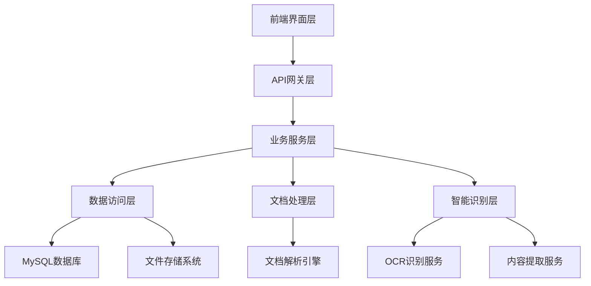

# 产品文档管理系统设计文档

## 概述

产品文档管理系统是保险产品智能检核系统的核心模块，负责产品要件文档的上传、存储、管理和智能检核功能。系统采用前后端分离架构，支持多种文档格式的处理和智能识别，为保险产品合规检查提供完整的文档管理解决方案。

## 架构设计

### 系统架构



### 技术架构

- **前端框架**: 现代Web前端框架，支持响应式设计
- **后端框架**: Spring Boot (Java)
- **数据库**: MySQL (关系型数据)
- **文件存储**: 本地文件系统或云存储
- **文档处理**: Apache POI, iText等文档处理库
- **智能识别**: OCR服务、自然语言处理服务

## 组件设计

### 1. 页面导航组件

**功能**: 提供从工作台到产品管理功能的导航入口

**组件结构**:
```
NavigationComponent
├── WorkbenchNavigation (工作台导航)
├── ProductManagementEntry (产品管理入口)
└── ProductImportEntry (导入产品入口)
```

**接口设计**:
- `navigateToProductManagement()`: 跳转到产品管理主界面
- `navigateToProductImport()`: 跳转到产品上传功能

### 2. 产品管理主界面组件

**功能**: 产品列表展示、筛选查询、操作管理

**组件结构**:
```
ProductManagementComponent
├── FilterQueryComponent (筛选查询组件)
├── ProductListComponent (产品列表组件)
└── PaginationComponent (分页组件)
```

**数据模型**:
```typescript
interface ProductInfo {
  id: string;
  fileName: string;
  reportType: string;
  updateTime: Date;
  developmentType: string;
  productCategory: string;
  mainSubInsurance: string;
  revisionType: string;
  businessArea: string;
  year: number;
  auditStatus: string;
}

interface FilterCriteria {
  fileName?: string;
  reportType?: string;
  developmentType?: string;
  productCategory?: string;
  mainSubInsurance?: string;
  revisionType?: string;
  businessArea?: string;
  year?: number;
}
```

### 3. 新增产品组件

**功能**: 产品模板选择、信息填写、要件上传

**组件结构**:
```
ProductCreationComponent
├── TemplateSelectionComponent (模板选择组件)
├── ProductFormComponent (产品表单组件)
│   ├── AgricultureInsuranceForm (农险表单)
│   └── FilingProductForm (备案产品表单)
├── DocumentUploadComponent (文档上传组件)
└── ValidationComponent (校验组件)
```

**表单数据模型**:
```typescript
interface AgricultureInsuranceForm {
  templateType: 'agriculture';
  reportType: string; // 必填
  productNature?: string;
  year?: number;
  productName: string; // 必填
  revisionType: string; // 必填
  originalProductNameAndNumber?: string;
  developmentMethod?: string;
  mainSubInsurance?: string;
  mainInsuranceInfo?: string;
  productCategory?: string;
  businessArea?: string;
}

interface FilingProductForm {
  templateType: 'filing';
  developmentType: string; // 必填
  productNature?: string;
  year?: number;
  productName: string; // 必填
  revisionType: string; // 必填
  originalProductNameAndFilingNumber?: string;
  reportType?: string;
  mainSubInsuranceType?: string;
  mainInsuranceInfo?: string;
  productCategory?: string;
  businessScope?: string;
  demonstrationClauseName: string; // 必填
  businessArea1?: string;
  businessArea2?: string;
  salesPromotionName?: string;
}
```

### 4. 文档处理组件

**功能**: 文档上传、解析、校验、存储

**组件结构**:
```
DocumentProcessingComponent
├── FileUploadComponent (文件上传组件)
├── DocumentParserComponent (文档解析组件)
├── ContentExtractionComponent (内容提取组件)
├── ValidationEngineComponent (校验引擎组件)
└── FileStorageComponent (文件存储组件)
```

**文档数据模型**:
```typescript
interface DocumentFile {
  id: string;
  fileName: string;
  fileType: DocumentType;
  filePath: string;
  fileSize: number;
  uploadTime: Date;
  productId: string;
  status: DocumentStatus;
  validationResults: ValidationResult[];
}

enum DocumentType {
  PRODUCT_REGISTRATION = 'product_registration',
  TERMS = 'terms',
  FEASIBILITY_REPORT = 'feasibility_report',
  ACTUARIAL_REPORT = 'actuarial_report',
  RATE_TABLE = 'rate_table'
}

enum DocumentStatus {
  UPLOADED = 'uploaded',
  PROCESSING = 'processing',
  VALIDATED = 'validated',
  FAILED = 'failed'
}

interface ValidationResult {
  type: ValidationType;
  status: 'pass' | 'fail';
  message: string;
}

enum ValidationType {
  COMPLETENESS = 'completeness',
  NAME_CONSISTENCY = 'name_consistency',
  TITLE_CONSISTENCY = 'title_consistency'
}
```

### 5. 要件详情组件

**功能**: 产品详情展示、附件管理、批量操作

**组件结构**:
```
ProductDetailComponent
├── ProductInfoComponent (产品信息组件)
├── AttachmentListComponent (附件列表组件)
├── DocumentPreviewComponent (文档预览组件)
└── BatchOperationComponent (批量操作组件)
```

**附件数据模型**:
```typescript
interface AttachmentInfo {
  id: string;
  fileName: string;
  fileType: string;
  format: string;
  lastUpdateTime: Date;
  auditStatus: string;
  originalFilePath: string;
  auditedFilePath?: string;
  previewUrl: string;
  downloadUrl: string;
}
```

## 数据模型设计

### 核心数据表

#### 1. 产品信息表 (products)
```sql
CREATE TABLE products (
  id VARCHAR(36) PRIMARY KEY,
  file_name VARCHAR(500) NOT NULL,
  template_type ENUM('agriculture', 'filing') NOT NULL,
  report_type VARCHAR(100),
  development_type VARCHAR(100),
  product_nature VARCHAR(100),
  year INT,
  product_name VARCHAR(500) NOT NULL,
  revision_type VARCHAR(100) NOT NULL,
  original_product_info VARCHAR(500),
  main_sub_insurance VARCHAR(100),
  main_insurance_info TEXT,
  product_category VARCHAR(100),
  business_area VARCHAR(500),
  business_scope VARCHAR(500),
  demonstration_clause_name VARCHAR(500),
  business_area1 VARCHAR(500),
  business_area2 VARCHAR(500),
  sales_promotion_name VARCHAR(500),
  status VARCHAR(50) DEFAULT 'draft',
  created_by VARCHAR(100),
  created_at TIMESTAMP DEFAULT CURRENT_TIMESTAMP,
  updated_at TIMESTAMP DEFAULT CURRENT_TIMESTAMP ON UPDATE CURRENT_TIMESTAMP,
  INDEX idx_product_name (product_name),
  INDEX idx_template_type (template_type),
  INDEX idx_status (status)
);
```

#### 2. 文档文件表 (document_files)
```sql
CREATE TABLE document_files (
  id VARCHAR(36) PRIMARY KEY,
  product_id VARCHAR(36) NOT NULL,
  file_name VARCHAR(500) NOT NULL,
  file_type ENUM('product_registration', 'terms', 'feasibility_report', 'actuarial_report', 'rate_table') NOT NULL,
  file_path VARCHAR(1000) NOT NULL,
  file_size BIGINT,
  file_format VARCHAR(20),
  upload_time TIMESTAMP DEFAULT CURRENT_TIMESTAMP,
  status ENUM('uploaded', 'processing', 'validated', 'failed') DEFAULT 'uploaded',
  validation_status ENUM('pending', 'pass', 'fail') DEFAULT 'pending',
  audit_file_path VARCHAR(1000),
  created_by VARCHAR(100),
  FOREIGN KEY (product_id) REFERENCES products(id) ON DELETE CASCADE,
  INDEX idx_product_id (product_id),
  INDEX idx_file_type (file_type),
  INDEX idx_status (status)
);
```

#### 3. 文档校验结果表 (validation_results)
```sql
CREATE TABLE validation_results (
  id VARCHAR(36) PRIMARY KEY,
  document_id VARCHAR(36) NOT NULL,
  validation_type ENUM('completeness', 'name_consistency', 'title_consistency') NOT NULL,
  status ENUM('pass', 'fail') NOT NULL,
  message TEXT,
  created_at TIMESTAMP DEFAULT CURRENT_TIMESTAMP,
  FOREIGN KEY (document_id) REFERENCES document_files(id) ON DELETE CASCADE,
  INDEX idx_document_id (document_id),
  INDEX idx_validation_type (validation_type)
);
```

## 接口设计

### 1. 产品管理接口

#### 产品列表查询
```http
GET /api/v1/products
Query Parameters:
- fileName: string (可选)
- reportType: string (可选)
- developmentType: string (可选)
- productCategory: string (可选)
- mainSubInsurance: string (可选)
- revisionType: string (可选)
- businessArea: string (可选)
- year: number (可选)
- page: number (默认1)
- size: number (默认10)

Response:
{
  "code": 200,
  "message": "success",
  "data": {
    "products": [ProductInfo],
    "total": number,
    "page": number,
    "size": number
  }
}
```

#### 创建产品
```http
POST /api/v1/products
Content-Type: application/json

Request Body:
{
  "templateType": "agriculture" | "filing",
  "productInfo": AgricultureInsuranceForm | FilingProductForm
}

Response:
{
  "code": 200,
  "message": "success",
  "data": {
    "productId": string
  }
}
```

### 2. 文档管理接口

#### 上传产品信息登记表
```http
POST /api/v1/products/{productId}/registration
Content-Type: multipart/form-data

Request:
- file: File (Excel格式)

Response:
{
  "code": 200,
  "message": "success",
  "data": {
    "extractedInfo": ProductFormData,
    "documentPaths": {
      "terms": string,
      "feasibilityReport": string,
      "actuarialReport": string,
      "rateTable": string
    }
  }
}
```

#### 上传要件文档
```http
POST /api/v1/products/{productId}/documents
Content-Type: multipart/form-data

Request:
- documentType: string (terms|feasibility_report|actuarial_report|rate_table)
- file: File

Response:
{
  "code": 200,
  "message": "success",
  "data": {
    "documentId": string,
    "validationResults": ValidationResult[]
  }
}
```

#### 获取产品详情
```http
GET /api/v1/products/{productId}

Response:
{
  "code": 200,
  "message": "success",
  "data": {
    "productInfo": ProductInfo,
    "documents": AttachmentInfo[]
  }
}
```

### 3. 文档预览和下载接口

#### 在线预览文档
```http
GET /api/v1/documents/{documentId}/preview
Query Parameters:
- type: string (original|audited) 默认original

Response:
{
  "code": 200,
  "message": "success",
  "data": {
    "previewUrl": string,
    "contentType": string
  }
}
```

#### 下载文档
```http
GET /api/v1/documents/{documentId}/download
Query Parameters:
- type: string (original|audited) 默认original

Response: File Stream
```

#### 批量下载
```http
POST /api/v1/documents/batch-download
Content-Type: application/json

Request Body:
{
  "documentIds": string[],
  "type": "original" | "audited"
}

Response: ZIP File Stream
```

## 错误处理设计

### 错误码定义
```typescript
enum ErrorCode {
  // 通用错误
  INVALID_PARAMETER = 'E001',
  UNAUTHORIZED = 'E002',
  FORBIDDEN = 'E003',
  NOT_FOUND = 'E004',
  INTERNAL_ERROR = 'E005',
  
  // 文档相关错误
  FILE_TOO_LARGE = 'D001',
  UNSUPPORTED_FILE_FORMAT = 'D002',
  FILE_UPLOAD_FAILED = 'D003',
  DOCUMENT_PARSE_FAILED = 'D004',
  VALIDATION_FAILED = 'D005',
  
  // 产品相关错误
  PRODUCT_NOT_FOUND = 'P001',
  DUPLICATE_PRODUCT_NAME = 'P002',
  REQUIRED_FIELD_MISSING = 'P003'
}
```

### 统一错误响应格式
```typescript
interface ErrorResponse {
  code: number;
  message: string;
  errorCode: string;
  details?: any;
  timestamp: string;
}
```

## 测试策略

### 单元测试
- 文档解析组件测试
- 校验引擎测试
- 数据访问层测试
- 业务逻辑测试

### 集成测试
- API接口测试
- 文件上传流程测试
- 数据库操作测试
- 第三方服务集成测试

### 端到端测试
- 完整的产品创建流程测试
- 文档上传和校验流程测试
- 用户界面交互测试

### 性能测试
- 大文件上传性能测试
- 批量操作性能测试
- 并发用户访问测试
- 数据库查询性能测试

## 安全设计

### 文件安全
- 文件类型白名单验证
- 文件大小限制
- 病毒扫描
- 文件内容安全检查

### 数据安全
- 敏感数据加密存储
- 数据传输HTTPS加密
- 数据访问权限控制
- 操作审计日志

### 接口安全
- API认证和授权
- 请求频率限制
- 参数验证和过滤
- SQL注入防护

## 部署架构

### 开发环境
- 单机部署
- 内存数据库
- 本地文件存储
- Mock外部服务

### 生产环境
- 负载均衡部署
- MySQL主从复制
- 分布式文件存储
- 容器化部署

### 监控和运维
- 应用性能监控
- 日志收集和分析
- 健康检查
- 自动化部署

## 扩展性设计

### 水平扩展
- 无状态服务设计
- 数据库分片
- 缓存集群
- 消息队列

### 功能扩展
- 插件化架构
- 配置化规则引擎
- 多租户支持
- 国际化支持