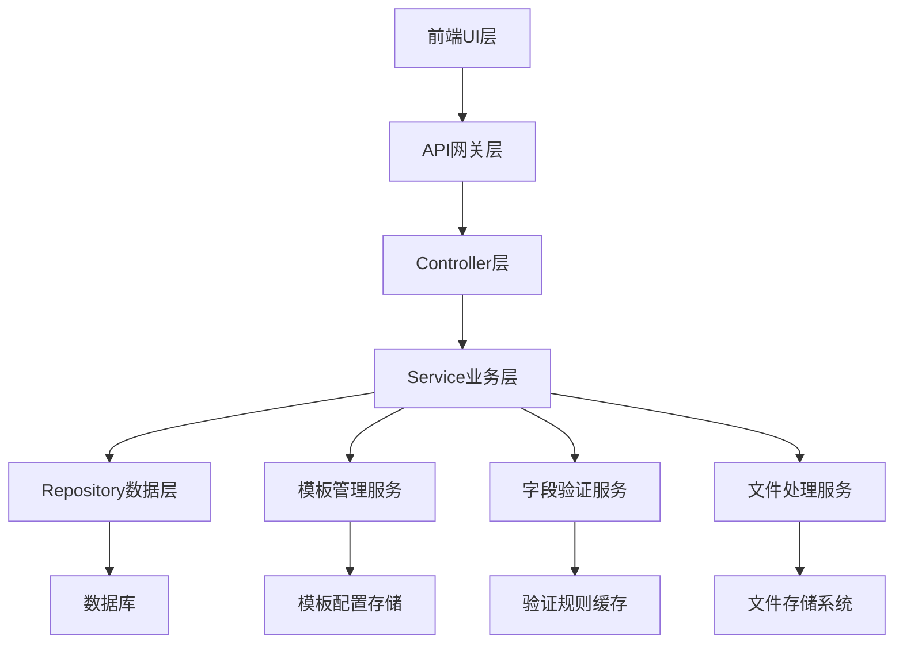

# 产品文档管理模板增强设计文档

## Overview

产品文档管理模板增强功能是对现有保险产品智能检核系统中产品文档管理模块的重要升级。该设计在保持现有架构和技术栈一致性的基础上，实现对两种新官方模板（备案产品自主注册信息登记表和农险产品信息登记表）的完整支持。

设计采用模块化、可扩展的架构，通过配置驱动的方式实现模板类型管理，确保系统能够灵活适应未来更多模板类型的加入。所有新增功能严格遵循现有的代码规范、安全标准和性能要求。

## Steering Document Alignment

### Technical Standards (tech.md)

**架构对齐**：
- 遵循前后端分离架构：Vue 3 + TypeScript 前端，Spring Boot 后端
- 使用现有技术栈：Ant Design Vue、MyBatis Plus、MySQL、Redis
- 保持RESTful API设计模式，统一响应格式
- 采用分层架构：Controller -> Service -> Repository -> Entity

**集成策略**：
- 复用现有的鉴权机制（JWT + Spring Security）
- 遵循现有的异常处理和日志记录模式
- 使用现有的配置管理和环境隔离策略
- 保持与现有API网关和限流机制的兼容性

**安全合规**：
- 文件上传严格类型验证，防止恶意文件
- 输入数据XSS和SQL注入防护
- 敏感操作审计日志记录
- 遵循现有的HTTPS和数据脱敏要求

### Project Structure (structure.md)

**代码组织遵循项目结构约定**：

**后端模块化**：
```
backend/src/main/java/com/insurance/audit/product/
├── application/service/          # 业务服务层
│   ├── TemplateService          # 新增：模板管理服务
│   ├── ProductEnhancedService   # 增强：产品服务扩展
│   └── ValidationService       # 增强：字段验证服务
├── domain/entity/               # 领域实体
│   ├── ProductTemplate         # 新增：模板配置实体
│   └── Product                 # 增强：产品实体字段扩展
├── infrastructure/mapper/       # 数据访问层
│   └── ProductTemplateMapper   # 新增：模板数据访问
└── interfaces/dto/              # 接口传输对象
    ├── request/                 # 请求DTO
    └── response/                # 响应DTO
```

**前端模块化**：
```
frontend/src/
├── components/product/          # 产品组件
│   ├── TemplateDownload        # 新增：模板下载组件
│   ├── EnhancedProductForm     # 增强：产品表单组件
│   └── FieldValidation         # 新增：字段验证组件
├── types/product/               # 类型定义
│   └── template.ts             # 新增：模板相关类型
├── api/product/                 # API服务
│   └── template.ts             # 新增：模板API服务
└── utils/                       # 工具函数
    └── templateValidation.ts   # 新增：模板验证工具
```

**模块边界**：
- 模板管理与现有产品管理解耦，通过接口交互
- 字段验证逻辑独立封装，支持配置化扩展
- 文件处理服务复用现有基础设施组件

## Code Reuse Analysis

### Existing Components to Leverage

- **BaseEntity**: 复用现有实体基类，包含ID、创建时间、更新时间等通用字段
- **ApiResponse**: 复用统一响应格式，保持API一致性
- **GlobalExceptionHandler**: 复用全局异常处理机制
- **AgriculturalProductForm.vue**: 扩展现有农险产品表单组件，增加新字段支持
- **FilingProductForm.vue**: 扩展现有备案产品表单组件（如果存在）
- **DocumentUploadComponent.vue**: 复用现有文档上传组件
- **ProductService**: 扩展现有产品服务，增加模板相关业务逻辑
- **DocumentValidationService**: 扩展现有文档验证服务

### Integration Points

- **现有产品管理API**: 扩展现有的ProductController，增加模板下载和字段配置接口
- **现有数据库表**: 在products表基础上增加新字段，保持向后兼容
- **现有文件存储**: 复用FileStorageService，存储模板文件和上传文档
- **现有缓存机制**: 利用Redis缓存模板配置和字段验证规则
- **现有权限系统**: 复用RBAC权限控制，确保模板下载和管理的安全性

## Architecture

系统采用经典的分层架构，结合领域驱动设计（DDD）原则，确保业务逻辑的清晰分离和技术实现的可维护性。

### Modular Design Principles

- **Single File Responsibility**: 每个文件专注于单一业务领域
  - TemplateService.java：专门处理模板管理逻辑
  - FieldValidationService.java：专门处理字段验证逻辑
  - ProductTemplateMapper.java：专门处理模板数据访问
- **Component Isolation**: 创建小型、专注的组件
  - TemplateDownload.vue：专门处理模板下载UI
  - FieldValidation.vue：专门处理字段验证UI
  - DynamicForm.vue：专门处理动态表单渲染
- **Service Layer Separation**: 分离数据访问、业务逻辑和表现层
  - Controller层：处理HTTP请求响应
  - Service层：处理业务逻辑和模板管理
  - Repository层：处理数据持久化
- **Utility Modularity**: 将工具函数拆分为专注的单一用途模块
  - templateValidation.ts：模板验证工具
  - fieldMapping.ts：字段映射工具
  - excelParser.ts：Excel解析工具



## Components and Interfaces

### Component 1: TemplateService（模板管理服务）
- **Purpose:** 管理产品模板的下载、配置和元数据
- **Interfaces:**
  - `List<TemplateInfo> getAvailableTemplates()`
  - `byte[] downloadTemplate(String templateType)`
  - `TemplateConfig getTemplateConfig(String templateType)`
  - `void updateTemplateConfig(TemplateConfig config)`
- **Dependencies:** FileStorageService、ProductTemplateMapper、Redis缓存
- **Reuses:** 现有的FileStorageService用于文件管理，ApiResponse用于统一响应

### Component 2: EnhancedProductForm（增强产品表单组件）
- **Purpose:** 渲染动态产品表单，支持双模板字段配置
- **Interfaces:**
  - `@prop templateType: string`
  - `@event formSubmit(formData: ProductFormData)`
  - `@event templateChange(templateType: string)`
- **Dependencies:** FieldValidation组件、模板API服务、表单验证工具
- **Reuses:** 现有的AgriculturalProductForm.vue作为基础，扩展字段支持

### Component 3: FieldValidationService（字段验证服务）
- **Purpose:** 提供基于模板规则的字段验证功能
- **Interfaces:**
  - `ValidationResult validateField(String fieldName, Object value, String templateType)`
  - `List<ValidationError> validateForm(Map<String, Object> formData, String templateType)`
  - `void loadValidationRules(String templateType)`
- **Dependencies:** ValidationRuleRepository、模板配置缓存
- **Reuses:** 现有的DocumentValidationService验证机制

### Component 4: TemplateDownload（模板下载组件）
- **Purpose:** 提供模板选择和下载功能
- **Interfaces:**
  - `@prop availableTemplates: TemplateInfo[]`
  - `@event downloadTemplate(templateType: string)`
- **Dependencies:** TemplateAPI服务、文件下载工具
- **Reuses:** 现有的文件下载机制和UI组件样式

### Component 5: ProductTemplateMapper（模板数据访问层）
- **Purpose:** 处理产品模板相关的数据库操作
- **Interfaces:**
  - `int insertTemplate(ProductTemplate template)`
  - `ProductTemplate selectByType(String templateType)`
  - `List<ProductTemplate> selectAllTemplates()`
  - `int updateTemplate(ProductTemplate template)`
- **Dependencies:** MyBatis Plus、MySQL数据库
- **Reuses:** 现有的BaseMapper接口和数据库连接配置

## Data Models

### ProductTemplate（产品模板实体）
```java
@TableName("product_templates")
public class ProductTemplate extends BaseEntity {
    // 模板类型（备案产品/农险产品）
    private String templateType;

    // 模板名称
    private String templateName;

    // 模板文件路径
    private String templateFilePath;

    // 字段配置JSON
    private String fieldConfig;

    // 验证规则JSON
    private String validationRules;

    // 是否启用
    private Boolean enabled;

    // 模板版本
    private String version;
}
```

### EnhancedProduct（增强产品实体）
```java
@TableName("products")
public class Product extends BaseEntity {
    // 现有字段保持不变...

    // 新增备案产品字段
    private String developmentType;      // 开发类型
    private String demonstrationClause;  // 示范条款名称
    private String businessScope;        // 经营范围
    private String businessArea1;        // 经营区域1
    private String businessArea2;        // 经营区域2
    private String productProperty;      // 产品属性
    private String basicRate;           // 基础费率
    private String basicRateTable;      // 基础费率表
    private Boolean hasElectronicPolicy; // 是否有电子保单
    private Boolean hasNationalEncryption; // 是否是国产加密算法
    private String insurancePeriod;      // 保险期间
    private String insuranceResponsibility; // 保险责任
    private String salesPromotionName;   // 销售推广名称
    private String salesArea;           // 销售区域
    private String salesChannel;        // 销售渠道

    // 新增农险产品字段
    private Integer revisionCount;       // 修订次数
    private String insuranceTarget;      // 保险标的
    private Boolean isOperated;         // 是否开办
    private String operationDate;       // 开办日期
    private String rateFloatingRange;   // 费率浮动区间
    private String rateFloatingCoefficient; // 费率浮动系数
    private String absoluteDeductible;  // 绝对免赔率（额）
    private String relativeDeductible;  // 相对免赔率（额）
    private String remarks;             // 备注栏

    // 模板类型标识
    private String templateType;        // 模板类型
}
```

### TemplateFieldConfig（模板字段配置）
```typescript
interface TemplateFieldConfig {
  fieldName: string;           // 字段名称
  fieldType: 'input' | 'select' | 'textarea' | 'number' | 'date';
  required: boolean;           // 是否必填
  maxLength?: number;          // 最大长度
  options?: string[];          // 下拉选项
  placeholder?: string;        // 占位符
  validationRules?: ValidationRule[];
  dependsOn?: string;          // 依赖字段
  showWhen?: DependencyCondition; // 显示条件
}

interface ValidationRule {
  type: 'required' | 'minLength' | 'maxLength' | 'pattern' | 'custom';
  value?: any;
  message: string;
  validator?: string;          // 自定义验证器名称
}
```

## Error Handling

### Error Scenarios

1. **模板文件不存在或损坏**
   - **Handling:** 返回HTTP 404错误，记录错误日志，提供模板恢复建议
   - **User Impact:** 显示"模板文件暂不可用，请联系管理员"的友好错误提示

2. **Excel文件解析失败**
   - **Handling:** 捕获解析异常，返回具体的格式错误信息，提供修正建议
   - **User Impact:** 显示详细的错误位置和修正指导

3. **字段验证失败**
   - **Handling:** 收集所有验证错误，批量返回错误详情
   - **User Impact:** 在对应字段下方显示红色错误提示，阻止表单提交

4. **数据存储失败**
   - **Handling:** 事务回滚，记录详细错误日志，返回通用错误信息
   - **User Impact:** 显示"数据保存失败，请重试"提示，保留用户输入数据

5. **网络请求超时**
   - **Handling:** 自动重试机制（最多3次），超时后返回友好错误
   - **User Impact:** 显示加载状态，超时后提供重试按钮

6. **权限验证失败**
   - **Handling:** 返回HTTP 403错误，记录访问日志
   - **User Impact:** 跳转到权限不足提示页面

7. **文件上传大小超限**
   - **Handling:** 前端预检查文件大小，后端二次验证
   - **User Impact:** 实时显示文件大小限制提示

8. **并发操作冲突**
   - **Handling:** 使用乐观锁机制，检测数据版本冲突
   - **User Impact:** 提示数据已被其他用户修改，建议刷新后重试

## Testing Strategy

### Unit Testing

**后端测试覆盖**：
- Service层测试：验证业务逻辑正确性，模拟依赖组件
- Mapper层测试：使用TestContainers测试数据库操作
- 工具类测试：验证Excel解析、字段验证等工具函数
- 覆盖率要求：新增代码单元测试覆盖率≥85%

**前端测试覆盖**：
- 组件测试：使用Vue Test Utils测试组件渲染和交互
- 工具函数测试：验证验证规则、字段映射等工具函数
- 状态管理测试：测试Pinia store的状态变更逻辑
- 覆盖率要求：新增代码单元测试覆盖率≥80%

### Integration Testing

**API集成测试**：
- 模板下载接口测试：验证文件下载流程
- 产品创建接口测试：验证完整的数据流转
- 字段验证接口测试：验证各种验证场景
- 文件上传接口测试：验证文件解析和存储

**数据库集成测试**：
- 使用TestContainers启动真实MySQL环境
- 验证数据库迁移脚本的正确性
- 测试复杂查询和事务操作
- 验证数据一致性和约束条件

### End-to-End Testing

**用户场景测试**：
- 完整产品导入流程：模板下载 → 填写表单 → 文件上传 → 提交成功
- 字段验证流程：错误输入 → 验证提示 → 修正后成功提交
- 模板切换流程：切换模板类型 → 表单重新渲染 → 字段正确显示
- 错误处理流程：网络异常 → 错误提示 → 重试成功

**兼容性测试**：
- 多浏览器兼容性测试（Chrome、Firefox、Safari、Edge）
- 响应式设计测试（桌面、平板、手机）
- 历史数据兼容性测试（确保现有数据正常显示）

**性能测试**：
- 文件上传性能测试（5MB文件上传时间≤30秒）
- 表单渲染性能测试（30个字段表单渲染时间≤1秒）
- 并发用户测试（100个并发用户，响应时间≤3秒）

**安全测试**：
- 文件上传安全测试（恶意文件检测）
- 输入验证安全测试（XSS、SQL注入防护）
- 权限控制测试（未授权访问阻断）